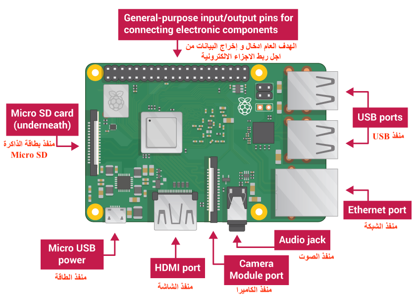

## التقي Raspberry Pi

دعونا نلقي نظرة على Raspberry Pi. يجب أن يكون لديك جهاز كمبيوتر Raspberry Pi أمامك لهذا الغرض. لا يجب أن يكون متصلاً بأي شيء حتى الآن.

+ انظر إلى Raspberry Pi. هل يمكنك العثور على جميع الأشياء المسمى على الرسم البياني؟

+ **منافذ USB** - يتم استخدامها لتوصيل الماوس ولوحة المفاتيح. يمكنك أيضًا توصيل المكونات الأخرى ، مثل محرك أقراص USB.

+ **فتحة بطاقة SD** - يمكنك فتح بطاقة SD هنا. هذا هو المكان الذي يتم فيه تخزين برنامج نظام التشغيل والملفات الخاصة بك.

+ **منفذ Ethernet** - يتم استخدام هذا لتوصيل Raspberry Pi بشبكة بها كابل. يمكن لـ Raspberry Pi أيضًا الاتصال بشبكة عبر الشبكة المحلية اللاسلكية.

+ **مقبس الصوت** - يمكنك توصيل سماعات الرأس أو السماعات هنا.

+ **منفذ HDMI** - هذا هو المكان الذي تقوم فيه بتوصيل جهاز العرض (أو جهاز الإسقاط) الذي تستخدمه لعرض الإخراج من Raspberry Pi. إذا كانت شاشتك تحتوي على مكبرات صوت ، فيمكنك أيضًا استخدامها لسماع الصوت.

+ **موصل طاقة Micro USB** - هذا هو المكان الذي تقوم بتوصيل مصدر طاقة. يجب عليك القيام بذلك دائمًا ، بعد أن تقوم بتوصيل جميع المكونات الأخرى الخاصة بك.

+ **منافذ GPIO** - تتيح لك هذه التوصيلات المكونات الإلكترونية مثل مصابيح LED والأزرار إلى Raspberry Pi.