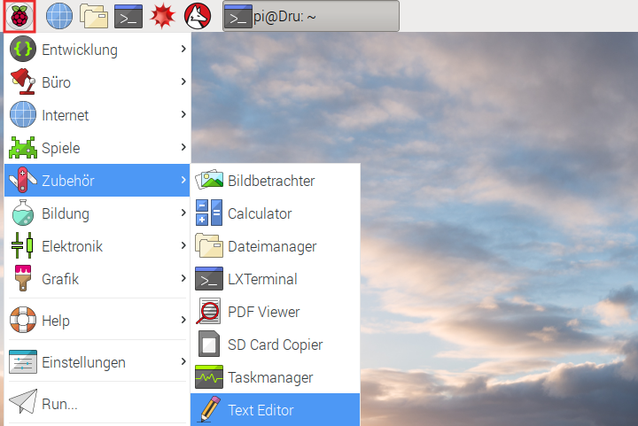
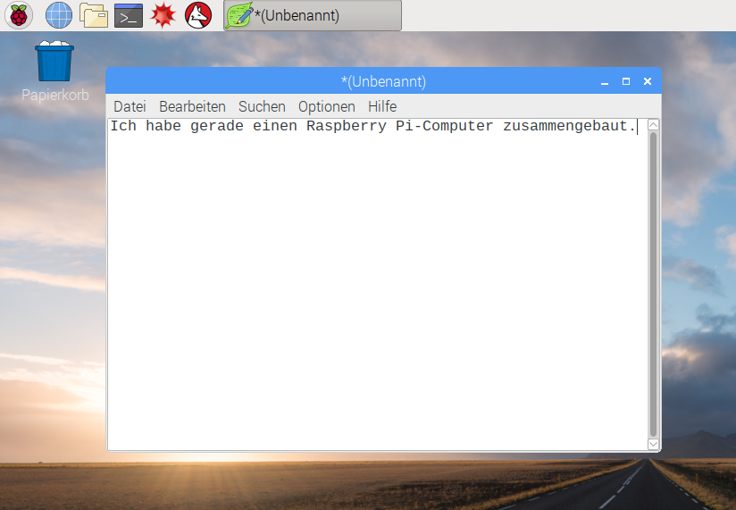
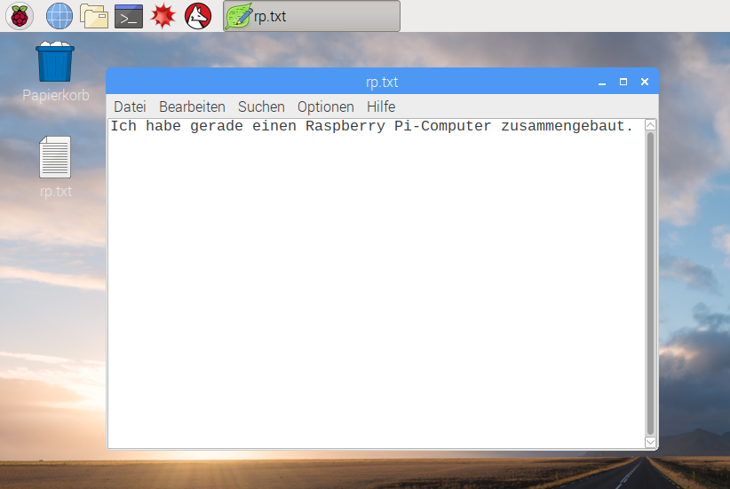
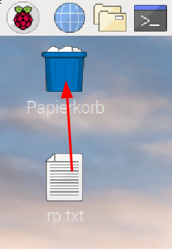

## Eine Tour durch den Raspberry Pi

Jetzt ist es Zeit für eine Tour durch den Raspberry Pi.

+ Sehen Sie, dass Raspberry in der oberen linken Ecke? Dort greifen Sie auf das Menü zu: Klicken Sie darauf und Sie finden viele Anwendungen.

+ Klicken Sie auf **Zubehör** und wählen Sie **Texteditor**.

+ Type `Ich habe gerade ein Raspberry Pi` im erscheinenden Fenster erstellt.

+ Klicken Sie auf **Datei**, wählen Sie dann **Speichern**, und klicken Sie dann auf **Desktop** und speichern Sie die Datei als `rp.txt`.

+ Auf dem Desktop sollte ein Symbol mit dem Namen `rp.txt` angezeigt werden.

Ihre Datei wurde auf der SD-Karte des Raspberry Pi gespeichert.

+ Schließen Sie den Texteditor, indem Sie auf **X** in der oberen rechten Ecke des Fensters klicken.

+ Kehren Sie zum Menü "Raspberry" zurück, wählen Sie " **Shutdown**" und dann " **Reboot**".

+ Wenn der Pi neu gestartet wurde, sollte Ihre Datei immer noch da sein.

+ Der Raspberry Pi betreibt eine Version eines Betriebssystems namens Linux (Windows und Mac OS sind andere Betriebssysteme). Sie können dies tun, indem Sie Befehle eingeben, anstatt auf die Menüoptionen zu klicken. Klicken Sie auf das **Terminal** oben auf dem Bildschirm:

+ Geben Sie im folgenden Fenster ein:

    ls
    

und drücken Sie dann <kbd>Geben Sie</kbd> auf der Tastatur ein.

Dadurch werden die Dateien in Ihrem Verzeichnis `home` aufgelistet.

+ Geben Sie diesen Befehl jetzt **c**hange **d**-Verzeichnis zum Desktop ein:

    CD-Desktop
    

Sie müssen nach jedem Befehl die Taste <kbd>Enter</kbd> drücken.

Art:

    ls
    

Können Sie die von Ihnen erstellte Datei sehen?

+ Schließen Sie das Terminalfenster, indem Sie auf **X** klicken.

+ Ziehen Sie nun `rp.txt` in den Papierkorb auf dem Desktop, damit das Pi für die nächste Person bereit ist.
    
    