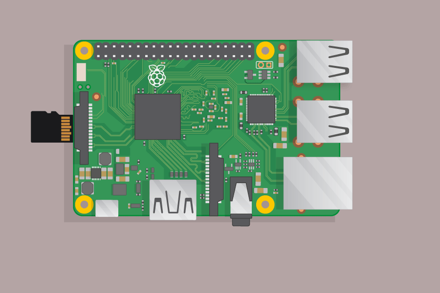

## Σύνδεσε το δικό σου Raspberry Pi

Ας συνδέσουμε το Raspberry Pi σου και να το ξεκινήσουμε.

+ Έλεγξε αν το Raspberry Pi έχει ήδη μια κάρτα SD στην υποδοχή στην κάτω πλευρά και εάν όχι, τοποθέτησε μία κάρτα SD με εγκατεστημένο το Raspbian (μέσω NOOBS). Πολλές κάρτες SD είναι μέσα σε ένα μεγαλύτερο προσαρμογέα. Μπορείς να βγάλεις την κάρτα έξω από αυτό χρησιμοποιώντας το χείλος στο κάτω μέρος.
    
    

[[[noobs-install]]]

+ Βρες το σύνδεσμο USB για το ποντίκι σου και σύνδεσέ το σε μια από τις θύρες USB του Raspberry Pi (δεν έχει σημασία ποια).
    
    

+ Σύνδεσε το πληκτρολόγιο με τον ίδιο τρόπο.
    
    

+ Κοίταξε τη θύρα HDMI στο Raspberry Pi - παρατήρησε ότι έχει μια μεγάλη επίπεδη πλευρά στην κορυφή.
    
    

Βεβαιώσου ότι η οθόνη σου είναι συνδεδεμένη σε πρίζα ρεύματος και είναι ενεργοποιημένη.

+ Σύνδεσε το καλώδιο οθόνης στη θύρα HDMI του Pi - χρησιμοποίησε έναν προσαρμογέα, εάν είναι απαραίτητο.

Τίποτα δεν θα εμφανιστεί ακόμα.

+ Σύνδεσε τα ακουστικά ή τα ηχεία με την υποδοχή ήχου, εάν έχεις κάποια.

+ Χρησιμοποίησε, αν έχεις, ένα καλώδιο ethernet για να συνδέσεις τη θύρα Ethernet του Raspberry Pi σε μία πρίζα Ethernet στον τοίχο ή στον δρομολογητή σου (router). (Δεν χρειάζεται να το κάνεις αυτό εάν χρησιμοποιείς ασύρματο LAN ή εάν δεν θέλεις να συνδεθείς στο Internet.)

+ Παρατήρησε ότι η θύρα τροφοδοσίας micro USB έχει μεγαλύτερη επίπεδη πλευρά στην κορυφή.

Σύνδεσε την παροχή ρεύματος σε μία πρίζα τοίχου και στη θύρα τροφοδοσίας micro USB.

Θα πρέπει να δεις ένα κόκκινο φως στο Raspberry Pi και σμέουρα στην οθόνη.

Το Pi θα εκκινήσει σε γραφική επιφάνεια εργασίας.

