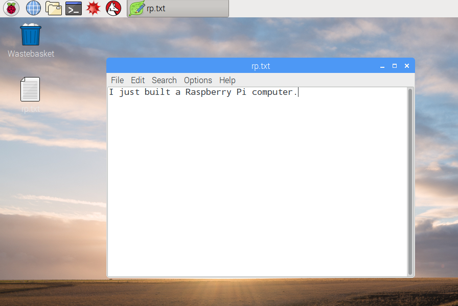

## Μια περιήγηση στο Raspberry Pi

Τώρα ήρθε η ώρα να κάνετε μια ξενάγηση στο Raspberry Pi.

+ Δείτε το Raspberry στην επάνω αριστερή γωνία; Εκεί θα έχετε πρόσβαση στο μενού: κάντε κλικ σε αυτό και θα βρείτε πολλές εφαρμογές.

+ Κάντε κλικ στο **Αξεσουάρ** και επιλέξτε **Text Editor**.

+ Πληκτρολογήστε `Δημιούργησα ένα Raspberry Pi` στο παράθυρο που εμφανίζεται.

+ Κάντε κλικ στο **Αρχείο**, στη συνέχεια επιλέξτε **Αποθήκευση**και, στη συνέχεια, κάντε κλικ στο **Desktop** και αποθηκεύστε το αρχείο ως `rp.txt`.

+ Θα εμφανιστεί ένα εικονίδιο με το όνομα `rp.txt` στην επιφάνεια εργασίας.

Το αρχείο σας έχει αποθηκευτεί στην κάρτα SD του Raspberry Pi.

+ Κλείστε τον επεξεργαστή κειμένου κάνοντας κλικ στο **X** στην επάνω δεξιά γωνία του παραθύρου.

+ Επιστρέψτε στο μενού Raspberry, επιλέξτε **Shutdown**και στη συνέχεια επιλέξτε **Επανεκκίνηση**.

+ Όταν το Pi έχει επανεκκινήσει, το αρχείο σας θα πρέπει να είναι ακόμα εκεί.

+ Το Raspberry Pi εκτελεί μια έκδοση ενός λειτουργικού συστήματος που ονομάζεται Linux (τα Windows και τα macOS είναι άλλα λειτουργικά συστήματα). Σας επιτρέπει να κάνετε συμβάν πληκτρολογώντας εντολές αντί να κάνετε κλικ στις επιλογές του μενού. Κάντε κλικ στο **Terminal** στο επάνω μέρος της οθόνης:

+ Στο παράθυρο που εμφανίζεται, πληκτρολογήστε:

    ls
    

και στη συνέχεια πατήστε <kbd>Εισαγάγετε</kbd> στο πληκτρολόγιο.

Θα εμφανιστούν τα αρχεία στον `κατάλογο` της χώρας σας.

+ Τώρα πληκτρολογήστε αυτήν την εντολή στο **c**hange **d**irectory στην επιφάνεια εργασίας:

    cd Desktop
    

Πρέπει να πατήσετε το πλήκτρο <kbd>Εισάγετε</kbd> μετά από κάθε εντολή.

Τύπος:

    ls
    

Μπορείτε να δείτε το αρχείο που δημιουργήσατε;

+ Κλείστε το παράθυρο του τερματικού κάνοντας κλικ στο **X**.

+ Τώρα σύρετε `rp.txt` στο Wastebasket στην επιφάνεια εργασίας, ώστε το Pi να είναι έτοιμο για το επόμενο άτομο.
    
    