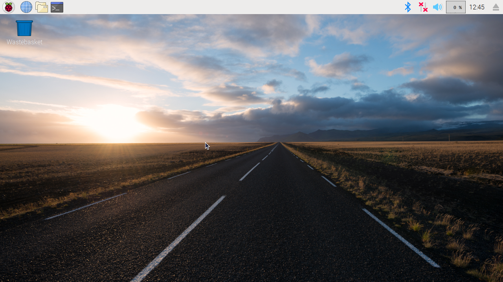

## Connect Your Pi

Let's connect up your Raspberry Pi and get it running.

+ Check whether your Raspberry Pi already has an SD card in the slot underneath the Pi, and if not, insert a SD card with Raspbian installed (via NOOBS).

	

Instructions for installing Raspbian on your SD card can be found in the "What you will need" step. Lots of SD cards will come inside a larger adapter, you can slide the card out using the lip at the bottom.

+ Find the USB connector for your mouse and connect the mouse to a USB port on the Raspberry Pi. It doesn't matter which one.

	

+ Connect the keyboard in the same way.

	

+ Look at the HDMI port on the Raspberry Pi and notice that it has a large flat side on top.

	

Make sure your monitor is plugged in and turned on.

Connect the monitor cable to the HDMI port, using an adapter if necessary.

Nothing will display yet.  

+ Connect headphones or speakers to the audio jack if you want to.

+ If you have one, connect an ethernet cable from the ethernet port on the Raspberry Pi to an ethernet socket on the wall or on your router. (You don't need to do this if you'll be using Wifi or not connecting to the internet.)

+ Notice that the micro USB power port has a longer flat side on top.

Plug in the power supply and connect it to the micro USB power input.

You should see a red light on the Raspberry Pi and raspberries on the monitor.

The Pi will boot up into a graphical desktop.

