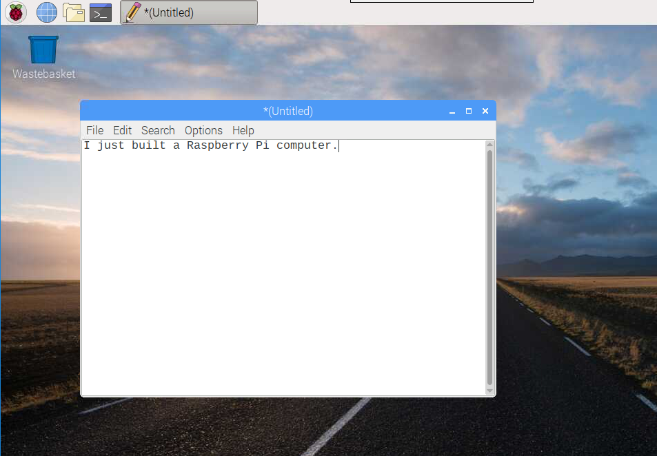
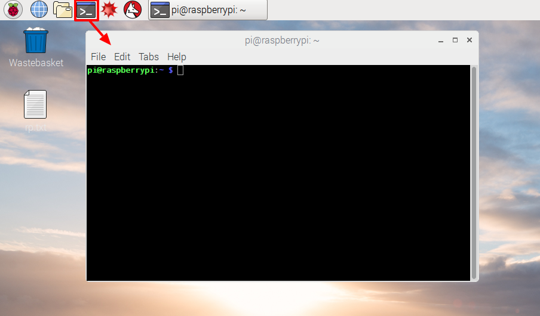

## A Tour of the Pi

Now it's time to take a tour of the Raspberry Pi.

+ See that Raspberry up in the top-left corner? That's the menu, click on it and you will find lots of applications.

+ Click 'Accessories' and choose 'Text Editor'

  

+ Type `I just built a Raspberry Pi` in the window that appears.

  

+ Choose 'File' then 'Save' and then click 'Desktop' and save the file as 'rp.txt'

  

+ You should see 'rp.txt' appear on the desktop.

  

+ Your file has been saved to the Raspberry Pi's SD card.

+ Close the text editor by clicking the 'X'

+ Return to the Raspberry menu and choose 'Shutdown' and then choose 'Reboot'.

+ When the Pi reloads your file should still be there.

+ The Raspberry Pi runs a version of an operating system called Linux (Windows and OS X are other operating systems.) You can type commands to do things. Click on the terminal at the top of the screen:

  

+ Now type:

```
ls
```

and then press <kbd>Enter</kbd> on the keyboard.

This will list the files in your 'home' directory.

+ Now type this command to **c**hange **d**irectory to the Desktop

```
cd Desktop
```

You have to press the <kbd>Enter</kbd> key after every command.

Type:

```
ls
```

Can you see the file you created?

+ Close the terminal by clicking on the 'X'.

+ Now drag `rp.txt` to the Wastebasket in the desktop so the Pi will be ready for the next person.  

	
