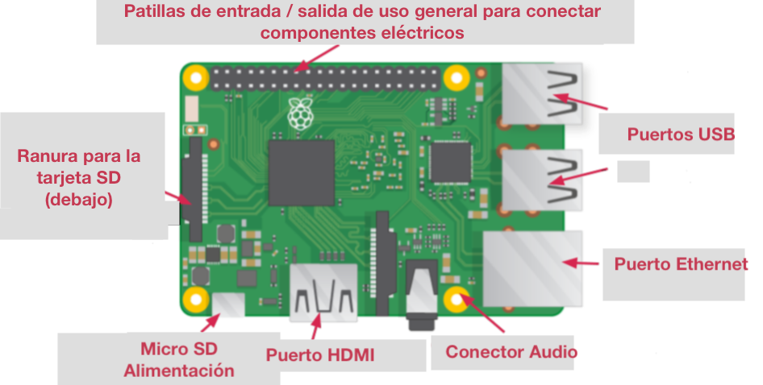

## Conoce a la Raspberry Pi

Echemos un vistazo a la Raspberry Pi. Deberías tener una computadora Raspberry Pi frente a ti para esto. No debería estar conectado a nada todavía.

+ Mira tu Raspberry Pi. ¿Puedes encontrar todas las cosas etiquetadas en el diagrama?

+ **Puertos USB** : se usan para conectar un mouse y un teclado. También puede conectar otros componentes, como una unidad USB.

+ **Ranura para tarjeta SD** - aquí puede colocar la tarjeta SD. Aquí es donde se almacenan el software del sistema operativo y sus archivos.

+ **Puerto Ethernet** - esto se usa para conectar el Raspberry Pi a una red con un cable. El Raspberry Pi también se puede conectar a una red a través de LAN inalámbrica.

+ **Conector de audio** - aquí puede conectar audífonos o parlantes.

+ **Puerto HDMI** : aquí es donde conecta el monitor (o proyector) que está utilizando para mostrar la salida de la Raspberry Pi. Si su monitor tiene parlantes, también puede usarlos para escuchar el sonido.

+ **Conector de alimentación micro USB** : aquí es donde conecta una fuente de alimentación. Siempre debe hacer esto último, después de haber conectado todos sus otros componentes.

+ **Puertos GPIO** : estos le permiten conectar componentes electrónicos como LED y botones a la Raspberry Pi.