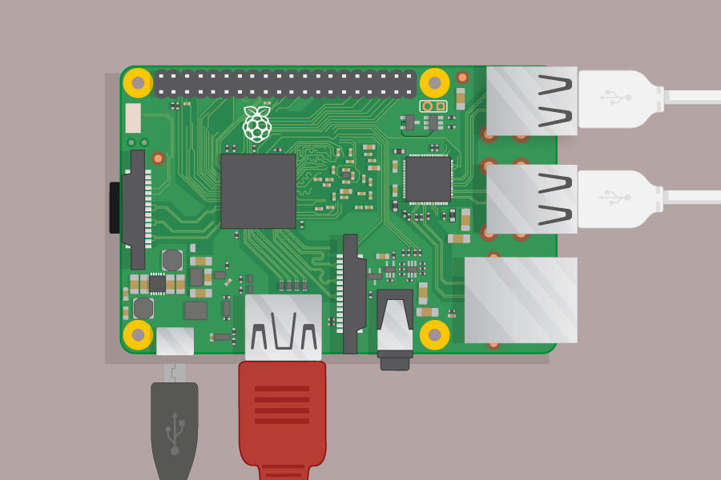

## Conecta tu Raspberry Pi

Vamos a conectar tu Raspberry Pi y ponerlo en funcionamiento.

+ Comprueba si tu Raspberry Pi ya tiene una tarjeta SD en la ranura en la parte inferior, y si no, inserta una tarjeta SD con Raspbian instalado (a través de NOOBS). Muchas tarjetas SD irán dentro de un adaptador más grande, y usted puede deslizar la tarjeta fuera de este usando el labio en la parte inferior.
    
    

[[[noobs-install]]]

+ Busque el conector USB para su mouse y conecte el mouse a uno de los puertos USB de la Raspberry Pi (no importa cuál).
    
    

+ Conecte el teclado de la misma manera.
    
    

+ Mire el puerto HDMI en el Raspberry Pi: observe que tiene un lado grande y plano en la parte superior.
    
    

Asegúrese de que su monitor esté enchufado a una toma de pared y encendido.

+ Conecte el cable del monitor al puerto HDMI del Pi; use un adaptador si es necesario.

Nada se mostrará aún.

+ Conecte auriculares o altavoces a la toma de audio si tiene alguno.

+ Si tiene uno, use un cable de ethernet para conectar el puerto de Ethernet en la Raspberry Pi a una toma de Ethernet en la pared o en su enrutador. (No necesita hacer esto si va a utilizar una LAN inalámbrica o si no desea conectarse a Internet).

+ Tenga en cuenta que el puerto de alimentación micro USB tiene un lado plano más largo en la parte superior.

Enchufe la fuente de alimentación en un enchufe y conéctelo al puerto de alimentación micro USB.

Debería ver una luz roja en la Raspberry Pi y frambuesas en el monitor.

El Pi se iniciará en un escritorio gráfico.

