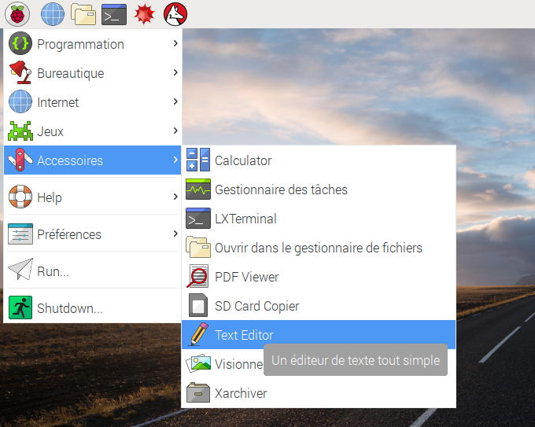
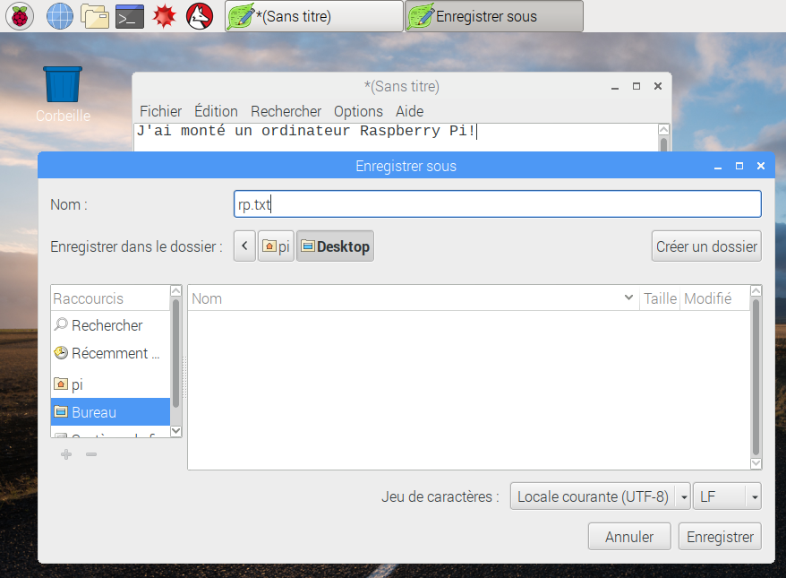
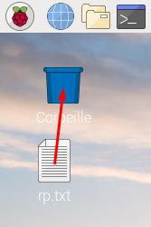

## Une visite du Pi

C'est maintenant le temps de faire une visite du Raspberry Pi.

+ Vous voyez la framboise dans le coin supérieur-gauche? C'est le menu. Cliquez dessus et vous y trouverez une multitude d'applications.

+ Cliquez 'Accessoires' et choisissez 'Text Editor' (éditeur de texte).

	  

+ Tapez `J'ai monté un ordinateur Raspberry Pi!` dans la fenêtre qui apparaît.

	  

+ Choisissez 'Fichier' puis 'Enregistrer' et puis cliquez sur 'Bureau' et enregistrez le fichier sous le nom 'rp.txt'.

	  

+ Vous devriez voir l'icone 'rp.txt' apparaître sur le bureau.

	  

+ Votre fichier a été sauvegardé sur la carte microSD du Pi.

+ Fermez l'éditeur de texte en cliquant sur le 'X'.

+ Retournez au menu du Raspberry Pi puis choisissez 'Shutdown...' puis choisissez 'Reboot'.

+ Après que le Pi ait redémarré, votre fichier devrait toujours s'y trouver.

+ Le Raspberry Pi exécute un version d'un système d'exploitation appelé Linux (Windows et OS X sont d'autres systèmes d'exploitation). Vous pouvez taper des commandes pour faire certaines choses. Cliquez sur l'icone de l'invite de commande dans la barre de lancement rapide au haut de l'écran:

	  

+ Maintenant tapez:

	```
	ls
	```

	puis pressez sur Entrée ('Enter') sur le clavier.

	Ceci va énumérer les fichiers dans votre répertoire (dossier) 'home'.

+ Maintenant tapez:

	```
	cd Desktop
	```

	Vous devez presser Entrée après chaque commande.

	Tapez:

	```
	ls
	```

	Pouvez-vous voir le fichier que vous avez créé?

+ Fermez l'invite de commande en cliquant sur le 'X'.

+ Maintenant glissez `rp.txt` dans la corbeille sur le bureau pour que le Pi soit prêt pour le prochain utilisateur.

	