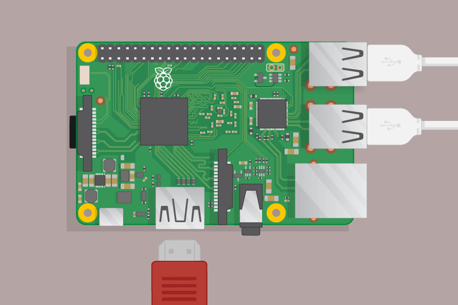

## Connectez votre Raspberry Pi

Connectez votre Raspberry Pi et lancez-le.

+ Vérifiez si votre Raspberry Pi possède déjà une carte SD dans la fente inférieure, et si ce n'est pas le cas, insérez une carte SD avec Raspbian installé (via NOOBS). Beaucoup de cartes SD viendront à l'intérieur d'un adaptateur plus grand, et vous pouvez faire glisser la carte à l'aide de la lèvre en bas.
    
    

[[[noobs-install]]]

+ Trouvez le connecteur USB pour votre souris, et connectez la souris à l'un des ports USB sur le Raspberry Pi (peu importe lequel).
    
    

+ Connectez le clavier de la même manière.
    
    

+ Regardez le port HDMI sur le Raspberry Pi - notez qu'il a un grand côté plat sur le dessus.
    
    

Assurez-vous que votre moniteur est branché dans une prise murale et allumé.

+ Connectez le câble du moniteur au port HDMI du Pi - utilisez un adaptateur si nécessaire.

Rien ne s'affichera pour le moment.

+ Connectez des écouteurs ou des haut-parleurs à la prise audio si vous en avez.

+ Si vous en avez un, utilisez un câble Ethernet pour connecter le port Ethernet du Raspberry Pi à une prise Ethernet sur le mur ou sur votre routeur. (Vous n'avez pas besoin de le faire si vous utilisez un réseau local sans fil ou si vous ne souhaitez pas vous connecter à Internet.)

+ Notez que le port d'alimentation micro USB a un côté plat plus long sur le dessus.

Branchez l'alimentation dans une prise et connectez-le au port d'alimentation micro-USB.

Vous devriez voir une lumière rouge sur le Raspberry Pi et les framboises sur le moniteur.

Le Pi va démarrer dans un bureau graphique.

