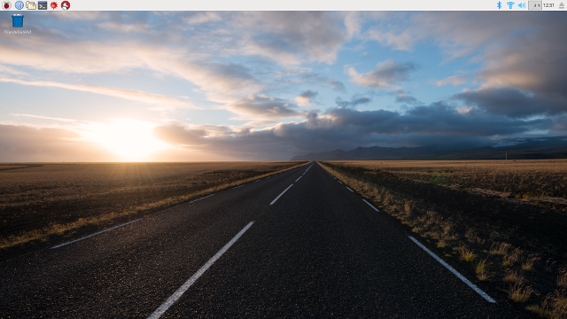

## חבר את הראספברי פאי שלך

Let's connect up your Raspberry Pi and get it running.

+ Check whether your Raspberry Pi already has an SD card in the slot at the underside, and if not, insert an SD card with Raspbian installed (via NOOBS).
    
    

**Note:** Lots of micro SD cards will come inside a larger adapter — you can slide the card out using the lip at the bottom.

[[[noobs-install]]]

+ Find the USB connector for your mouse, and connect the mouse to one of the USB port on the Raspberry Pi (it doesn't matter which one).
    
    

+ Connect the keyboard in the same way.
    
    

+ Look at the HDMI port on the Raspberry Pi — notice that it has a large flat side on top.
    
    

Make sure your monitor is plugged into a wall socket and turned on.

+ Connect the monitor cable to the Pi's HDMI port — use an adapter if necessary.

Nothing will display yet.

+ If you want to connect the Pi to the internet via Ethernet, use an Ethernet cable to connect the Ethernet port on the Raspberry Pi to an Ethernet socket on the wall or on your internet router. You don't need to do this if you'll be using WiFi or if you don't want to connect to the internet.

+ Sound will come from your screen if it has speakers or you can connect headphones or speakers to the audio jack if you have them.

+ Notice that the micro USB power port has a longer flat side on top.

Plug the power supply into a socket and connect it to the micro USB power port.

You should see a red light on the Raspberry Pi and raspberries on the monitor.

The Pi will boot up into a graphical desktop.

