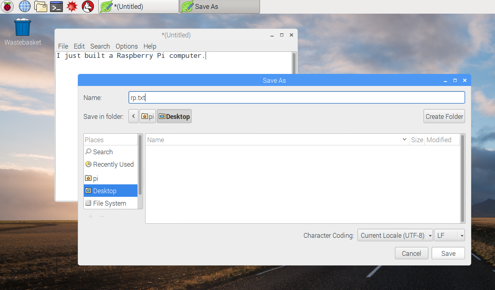

## סיור של פטל פטל

עכשיו הגיע הזמן לקחת סיור של פטל פטל.

+ רואה את זה פטל למעלה בפינה השמאלית העליונה? זה המקום שבו אתה לגשת לתפריט: לחץ על זה, תוכלו למצוא המון יישומים.

+ לחץ על **עזרים** ובחר **עורך טקסט**.

+ סוג `אני פשוט בנוי פטל פי` בחלון שמופיע.

+ לחץ על **קובץ**, ולאחר מכן בחר **שמור**ולאחר מכן לחץ על **Desktop** ושמור את הקובץ כ- `rp.txt`.

+ אתה אמור לראות סמל בשם `rp.txt` בשולחן העבודה.

הקובץ נשמר בכרטיס ה- SD של Raspberry Pi.

+ סגור את עורך הטקסט על ידי לחיצה על **X** בפינה הימנית העליונה של החלון.

+ חזור לתפריט Raspberry, בחר **Shutdown**ולאחר מכן בחר **אתחול מחדש**.

+ כאשר pi יש אתחול מחדש, הקובץ שלך עדיין צריך להיות שם.

+ פספל פייס מפעילה גרסה של מערכת הפעלה בשם לינוקס (Windows ו- MacOS הן מערכות הפעלה אחרות). It allows you to make things happen by typing commands instead of clicking on menu options. לחץ על **מסוף** שבחלק העליון של המסך:

+ בחלון שמופיע, הקלד:

    אני
    

ולאחר מכן לחץ על <kbd>הזן</kbd> במקלדת.

פעולה זו תציג את הקבצים בספריה `home` שלך.

+ כעת, הקלד פקודה זו אל **c**hange **d**directory אל שולחן העבודה:

    שולחן העבודה
    

עליך ללחוץ על המקש <kbd>Enter</kbd> לאחר כל פקודה.

סוּג:

    אני
    

האם אתה יכול לראות את הקובץ שיצרת?

+ סגור את חלון המסוף על ידי לחיצה על **X**.

+ עכשיו גרור `rp.txt` לפסולת בשולחן העבודה כדי שה- Pi יהיה מוכן לאדם הבא.
    
    