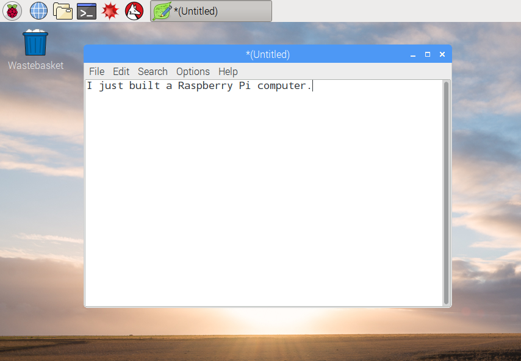

## Razgled Maline Malte

Sada je vrijeme za obilazak maline Pi.

+ Vidite li malinu u gornjem lijevom kutu? Tamo ćete pristupiti izborniku: kliknite na njega i naći ćete mnogo aplikacija.

+ Kliknite **Pribor** i odaberite **Uređivač teksta**.

+ Upišite `Upravo sam sagradio malinu Pi` u prozor koji se pojavljuje.

+ Kliknite na **Datoteku**, a zatim odaberite **Spremi**, a zatim kliknite **Desktop** i spremite datoteku kao `rp.txt`.

+ Trebali biste vidjeti ikonu nazvanu `rp.txt` koja se pojavljuje na radnoj površini.

Vaša je datoteka spremljena na SD karticu Raspberry Pi.

+ Zatvorite uređivač teksta tako da kliknete **X** u gornjem desnom kutu prozora.

+ Vratite se na izbornik Malina, odaberite **Shutdown**, a zatim odaberite **Ponovno podizanje sustava**.

+ Kada se Pi ponovo pokrenuo, datoteka bi trebala ostati tamo.

+ Raspberry Pi pokreće verziju operacijskog sustava pod nazivom Linux (Windows i MacOS su drugi operacijski sustavi). It allows you to make things happen by typing commands instead of clicking on menu options. Kliknite na **terminala** pri vrhu zaslona:

+ U prikazanom prozoru upišite:

    ls
    

i zatim pritisnite <kbd>Unesite</kbd> na tipkovnici.

Ovo će popis datoteka u `home` direktoriju.

+ Sada upišite ovu naredbu na **c**hange **d**uređivanje na radnu površinu:

    cd Desktop
    

Morate pritisnuti tipku <kbd>Unesite</kbd> nakon svake naredbe.

Tip:

    ls
    

Možete li vidjeti datoteku koju ste stvorili?

+ Zatvorite prozor terminala klikom na **X**.

+ Sada povucite `rp.txt` u koš za otpad na radnoj površini kako bi Pi bio spreman za sljedeću osobu.
    
    