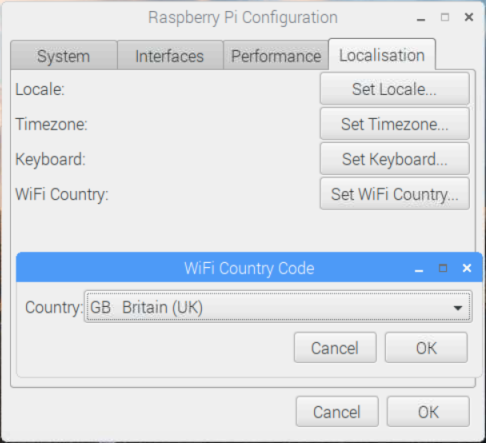

## ウェブの閲覧

ラズベリーパイをインターネットに接続する場合もあります。 イーサネットケーブルを接続していない場合は、無線ネットワーク（Wi-Fi）に接続する必要があります。

ラズベリーパイでWi-Fiを使用する前、Wi-Fiの国を設定する必要があります。

+ メニューから **Preferences**、 **Raspberry Pi Configuration** を選択します。

+ **Localisation** タブをクリックします。

+ **Set WiFi Country** ボタンをクリックします。

+ リストから国を選択し、**OK** をクリックします。

Wi-Fi国が設定されると、無線LANに接続できます。

+ 画面の右上隅にある赤い十字のアイコンをクリックし、ドロップダウンメニューからネットワークを選択します。 どのネットワークを選ぶべきか大人に質問する必要があるかもしれません。

+ ワイヤレスネットワークのパスワードを入力するか、大人に入力して **OK**をクリックしてください。

+ Piがインターネットに接続されると、赤い十字の代わりに無線LANの記号が表示されます。

+ Webブラウザのアイコンをクリックして、 `raspberry pi`を検索します。

