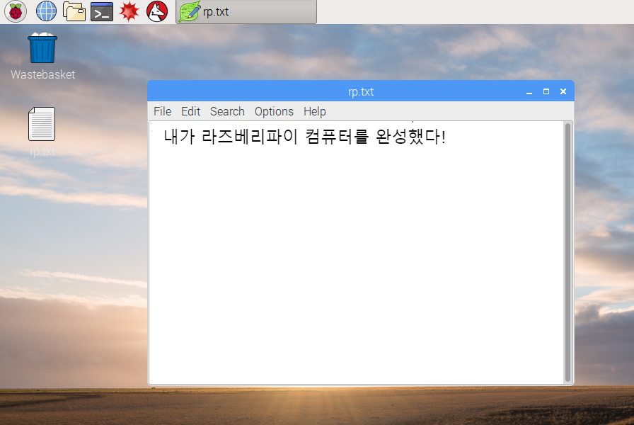

## 라즈베리파이 여행

이제 라즈베리파이를 둘러보십시오.

+ 왼쪽 상단 모서리에 라즈베리가 보이십니까? 그것을 통해 메뉴에 액세스 할 수 있습니다: 클릭해보면 다양한 응용 프로그램을 찾을 수 있습니다.

+ ** Accessories **를 클릭하고 **Text Editor**을 선택하십시오.

+ `유형 창에 나타나는 라즈베리 파이` 을 만들었습니다.

+ **파일**을 클릭하고 **저장**을 선택한 다음 **데스크톱** 을 클릭하고 파일을 `rp.txt`로 저장하십시오.

+ 바탕 화면에 `rp.txt` 아이콘이 나타납니다.

파일이 라즈베리파이의 SD 카드에 저장되었습니다.

+ 창의 오른쪽 상단 모서리에있는 **X** 을 클릭하여 텍스트 편집기를 닫습니다.

+ 라즈베리 메뉴로 돌아가서 **Shutdown**을 선택한 다음 **Reboot**을 선택하십시오.

+ 라즈베리파이가 재부팅 되고난 후에도 파일이 여전히 있어야합니다.

+ 라즈베리파이는 Linux 라고 불리는 한 형태의 운영 체제로 실행됩니다. (Windows 및 macOS는 다른 운영 체제입니다.) 이 운영체제는 메뉴 옵션을 클릭하는 대신 명령을 입력하여 작업을 수행 할 수 있습니다. 화면 상단의 **Terminal** 을 클릭하십시오.

+ 나타나는 창에서 다음을 입력하십시오.

    ls
    

그런 다음 키보드에서 <kbd>엔터</kbd>를 누르십시오.

그러면 `home` 디렉토리 내의 파일이 나열될 것입니다.

+ 이제 디렉토리 변경을 위해서 **c**hange **d**irectory 명령을 Desktop에 내려보십시오.

    cd Desktop
    

각 명령 다음에 <kbd>Enter</kbd> 키를 눌러야합니다.

유형:

    ls
    

당신이 만든 파일을 찾아볼 수 있습니까?

+ **X**을 클릭하여 터미널 창을 닫으십시오.

+ 이제 `rp.txt` 을 바탕 화면의 휴지통으로 드래그하여 다음 사람이 라즈베리파이를 사용할 수 있도록 준비하십시오.
    
    