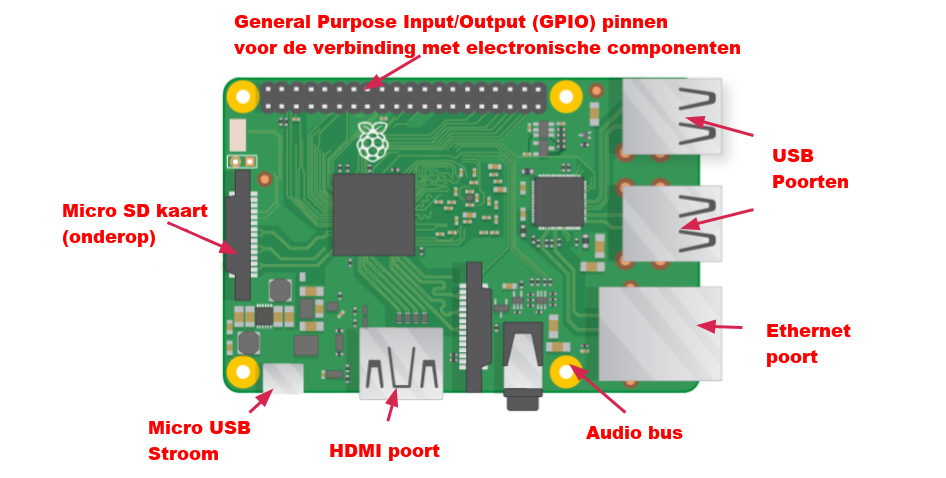

## Maak kennis met de Raspberry Pi

Laten we de Raspberry Pi bekijken. Voor dit zou je een Raspberry Pi-computer voor je moeten hebben. Er moet nog niets mee verbonden zijn.

+ Kijk naar je Raspberry Pi. Kun je alle dingen vinden die op het diagram zijn vermeld?

+ **USB-poorten** - deze worden gebruikt om een ​​muis en toetsenbord aan te sluiten. U kunt ook andere componenten aansluiten, zoals een USB-station.

+ **SD-kaartslot** - hier kun je de SD-kaart plaatsen. Hier worden de software van het besturingssysteem en uw bestanden opgeslagen.

+ **Ethernetpoort** - dit wordt gebruikt om de Raspberry Pi via een kabel met een netwerk te verbinden. De Raspberry Pi kan ook via een draadloos LAN verbinding maken met een netwerk.

+ **Audio-aansluiting** - hier kunt u een koptelefoon of luidsprekers aansluiten.

+ **HDMI-poort** - hier sluit u de monitor (of projector) aan die u gebruikt om de uitvoer van de Raspberry Pi weer te geven. Als uw monitor luidsprekers heeft, kunt u deze ook gebruiken om geluid te horen.

+ **Micro USB-stroomaansluiting** - hier sluit u een voeding aan. Je moet dit altijd als laatste doen, nadat je al je andere componenten hebt verbonden.

+ **GPIO-poorten** - hiermee kunt u elektronische componenten zoals LED's en knoppen verbinden met de Raspberry Pi.