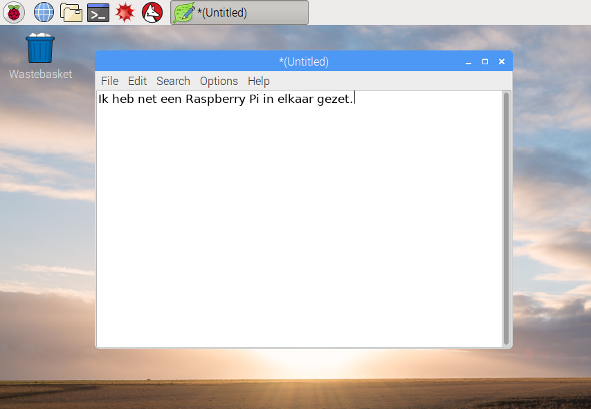
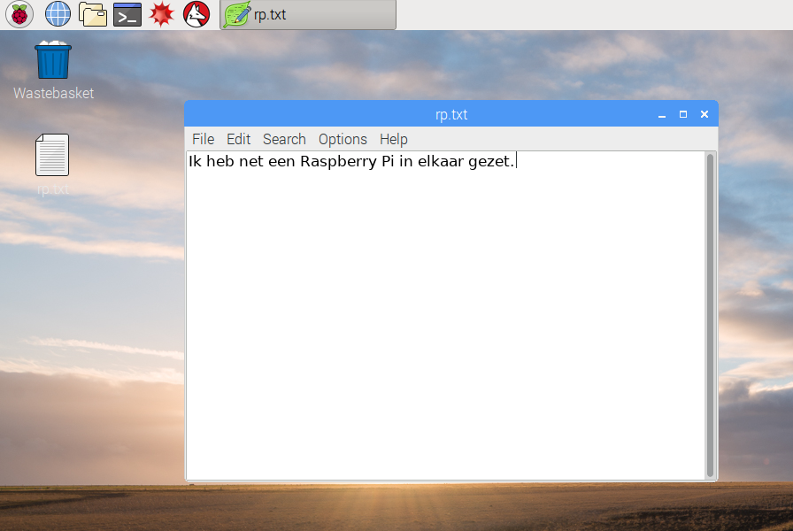

## Een Raspberry Pi rondleiding

Nu is het tijd voor een rondleiding door de Raspberry Pi.

+ Zie je die framboos in de linkerbovenhoek? Dat is waar je het menu opent: klik erop voor de vele toepassingen.

+ Klik op **Accessories** en kies **Text Editor**.

+ Typ `Ik heb net een Raspberry Pi in elkaar gezet` in het venster dat verschijnt.

+ Klik op **File**, kies **Save** en klik dan vervolgens op **Desktop** en sla het bestand op als `rp.txt`.

+ Er zou een pictogram met de naam `rp.txt` op het bureaublad moeten verschijnen.

Het bestand is opgeslagen op de SD-kaart van de Raspberry Pi.

+ Sluit de teksteditor door te klikken op **X** in de rechterbovenhoek van het venster.

+ Keer terug naar het Raspberry-menu, kies **Shutdown** en **Reboot**.

+ Wanneer de Pi opnieuw is opgestart, moet het bestand er nog steeds zijn.

+ Op de Raspberry Pi loopt een versie van een besturingssysteem met de naam Linux (Windows en macOS zijn andere besturingssystemen). Je kunt opdrachten typen in plaats van op menu-opties te klikken. Klik op de **Terminal** boven aan het scherm:

+ Typ in het venster dat verschijnt:

    ls
    

en druk dan op <kbd>Voer</kbd> in op het toetsenbord.

Hiermee worden de bestanden in uw `-startpagina` vermeld.

+ Typ nu deze opdracht naar **c**hange **d**adresregel naar het bureaublad:

    cd Desktop
    

U moet na elke opdracht op de <kbd></kbd> -toets drukken.

Type:

    ls
    

Kun je het bestand zien dat je hebt gemaakt?

+ Sluit het terminalvenster door op **X** te klikken.

+ Versleep nu `rp.txt` naar de Wastebasket op het bureaublad zodat de Pi klaar is voor de volgende persoon.
    
    