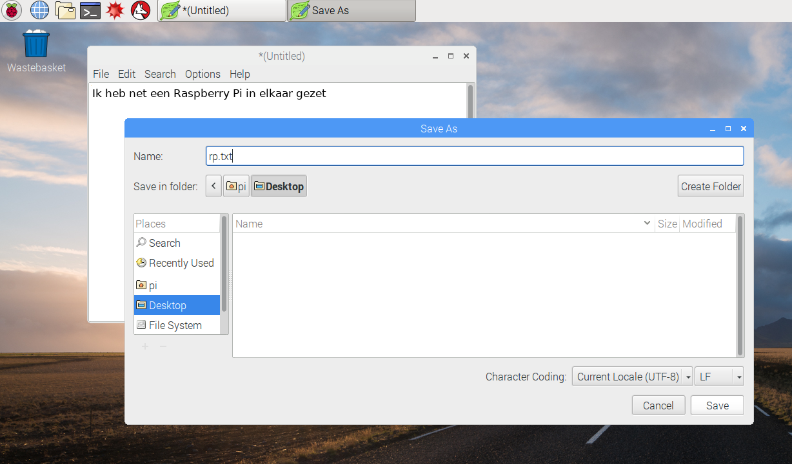

## Een rondleiding door de Raspberry Pi

Nu is het tijd voor een rondleiding door de Raspberry Pi.

+ Zie je die framboos in de linkerbovenhoek? Dat is waar u het menu opent: klik erop en u zult veel toepassingen vinden.

+ Klik op **Accessoires** en kies **Teksteditor**.

+ Type `Ik heb net een Raspberry Pi` gebouwd in het venster dat verschijnt.

+ Klik op **Bestand**, kies vervolgens **Opslaan**en klik vervolgens op **Desktop** en sla het bestand op als `rp.txt`.

+ Er zou een pictogram met de naam `rp.txt` op het bureaublad moeten verschijnen.

Uw bestand is opgeslagen op de SD-kaart van de Raspberry Pi.

+ Sluit de teksteditor door te klikken op **X** in de rechterbovenhoek van het venster.

+ Keer terug naar het Raspberry-menu, kies **Shutdown**en kies **Reboot**.

+ Wanneer de Pi opnieuw is opgestart, moet uw bestand er nog steeds zijn.

+ De Raspberry Pi voert een versie uit van een besturingssysteem genaamd Linux (Windows en macOS zijn andere besturingssystemen). Je kunt het laten gebeuren door opdrachten te typen in plaats van op menu-opties te klikken. Klik op de **Terminal** boven aan het scherm:

+ Typ in het venster dat verschijnt:

    ls
    

en druk dan op <kbd>Voer</kbd> in op het toetsenbord.

Hiermee worden de bestanden in uw `-startpagina` vermeld.

+ Typ nu deze opdracht naar **c**hange **d**adresregel naar het bureaublad:

    cd Desktop
    

U moet na elke opdracht op de <kbd></kbd> -toets drukken.

Type:

    ls
    

Kun je het bestand zien dat je hebt gemaakt?

+ Sluit het terminalvenster door op **X** te klikken.

+ Versleep nu `rp.txt` naar de Wastebasket op het bureaublad zodat de Pi klaar is voor de volgende persoon.
    
    