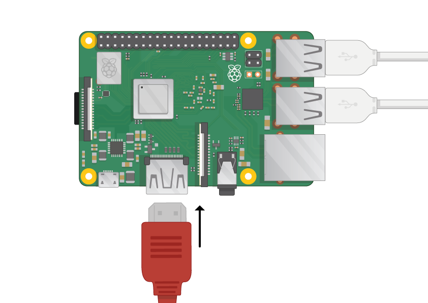

## 连接你的树莓派

让我们连接你的树莓派并让它运行起来。

+ 检查您的树莓派是否已在底部的插槽中安装了SD卡，如果没有，请插入安装了Raspbian（通过NOOBS）的SD卡。
    
    

**注意：** 许多的micro SD卡都是插在一个大一号的适配器里的 - 您可以使用底部的唇缘将卡滑出。

[[[noobs-install]]]

+ 找到USB接口，并将鼠标连接到树莓派上的其中一个USB端口（无论哪一个都没关系）。
    
    

+ 以相同的方式连接键盘。
    
    

+ 看看树莓派上的HDMI接口 - 请注意它顶部有一个大而扁平的侧面。
    
    

确保您的屏幕电源已插入墙壁插座并打开显示器开关。

+ 将显示器视频线连接到树莓派的HDMI端口 -- 必要时需要使用适配器。

此时还什么都没有显示。

+ 如果要通过以太网将Pi连接到因特网，请使用以太网网线将树莓派上的以太网接口连接到墙上或路由器上的以太网接口。 如果您要使用WiFi或者您不想连接到互联网，则无需执行此操作。

+ 如果屏幕带有扬声器，声音将来自您的屏幕，或者如果您有耳机或扬声器，则可以将它们连接到音频插孔。

+ 请注意，micro USB电源端口顶部有较长的平面。

将电源插入插座并将其连接到Pi的Micro USB电源接口。

你应该看到树莓派上的红灯亮起并且显示器上显示出树莓图案。

树莓派将启动并进入到图形桌面。

