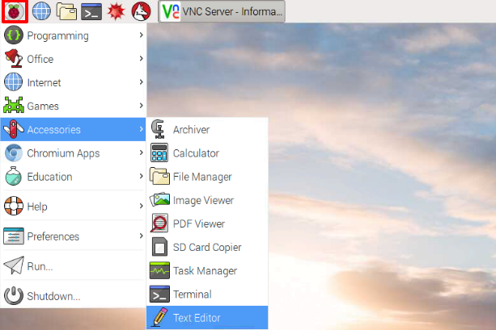

## 參觀樹莓派

現在是時候去參觀Raspberry Pi了。

+ 看到在左上角的樹莓？ 這就是你訪問菜單的地方：點擊它，你會發現很多應用程序。

+ 點擊 **附件** ，然後選擇 **文本編輯器**。

+ 類型 `我剛剛在出現的窗口中構建了Raspberry Pi`。

+ 單擊 **文件**，然後選擇 **保存**，然後單擊 **桌面** 並將文件另存為 `rp.txt`。

+ 您應該看到名為 `的圖標rp.txt` 出現在桌面上。

您的文件已保存到Raspberry Pi的SD卡上。

+ 單擊窗口右上角的 **X** 關閉文本編輯器。

+ 返回到樹莓菜單，選擇 **關機**，然後選擇 **重啟**。

+ 當Pi重新啟動時，你的文件應該仍然在那裡。

+ Raspberry Pi運行稱為Linux的操作系統版本（Windows和MacOS是其他操作系統）。 It allows you to make things happen by typing commands instead of clicking on menu options. 點擊屏幕頂部的 **終端**：

+ 在出現的窗口中，輸入：

    LS
    

然後按 <kbd>在鍵盤上輸入</kbd>。

這將列出 `主目錄` 目錄中的文件。

+ 現在，將此命令鍵入 **c**將 **d**目錄更改為桌面：

    cd桌面
    

您必須在每個命令後按 <kbd>Enter</kbd> 鍵。

類型：

    LS
    

你能看到你創建的文件嗎？

+ 點擊 **X**關閉終端窗口。

+ 現在將 `rp.txt` 拖動到桌面上的廢紙簍，以便Pi可以為下一個人準備好。
    
    